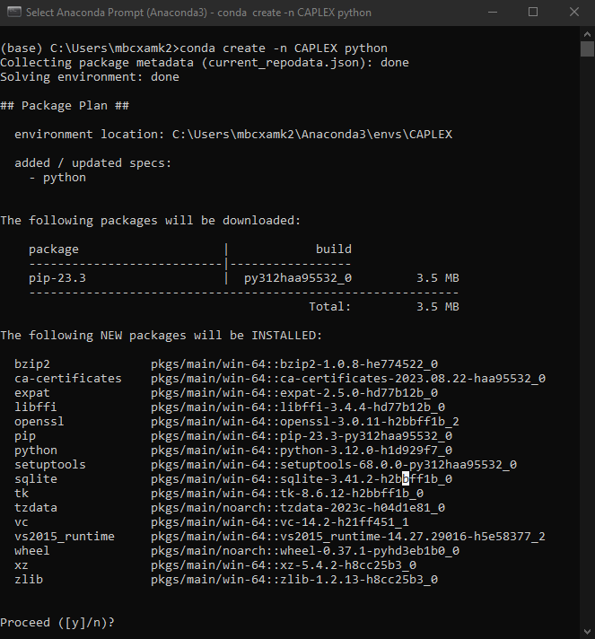

<b><font color=#FF0000>If you follow this tutorial but find yourself stuck, please submit an issue in the <a id="tutorialIssue" href="https://github.com/OSIPI/OSIPI_CAPLEX/issues">github repository</a> and include all steps you have taken and the full traceback to the error you've encountered so we may improve this page.</font></b>

This is a basic tutorial on how to contribute to the website if you've never used github, git or written any code for a website before. You can either [use a remote environment](#work-in-a-new-development-container) via GitHub, or [use your local machine](#install-anaconda).

[Click here](#where-to-find-documentation) to skip the "setting up workspace" tutorial.

<font size=5>Work in a remote environment</font>

## Work in a new development container

A [dev container](https://docs.github.com/en/codespaces/setting-up-your-project-for-codespaces/adding-a-dev-container-configuration/introduction-to-dev-containers){target = "_blank"} is a [Docker](https://www.docker.com/){target = "_blank"} container specifically configured by us to provide you with a development environment where you can make the changes you want without having to install/setup anything locally. Simply start up a new dev container, wait for it to be built and code away!

To create a new codespace (which contains the devcontainer), navigate to a [GitHub branch](https://github.com/OSIPI/OSIPI_CAPLEX/tree/main-major-development){target = "_blank"} that contains a `devcontainer.json` file. On the upper right side of the page find the `<> Code` button, click it, click on `Codespaces` (instead of `Local`) and `Create codespace on <branch name>`. Wait for the codespace to be built and start coding.


If you're not familiar with Git, skip to parts 1 and 4 in [Setting up GitHub](#setting-up-github). In the section [Work on a local version of the website](#work-on-a-local-version-of-the-website) you don't need to use `cd`, simply write `mkdocs serve` in the terminal that opens at the bottom of your screen and the website will be built for you. If you wish to add files, such as images or gifs, from your machine to a folder in the devcontainer, simply drag the file over to the folder in the `Explorer` on the left-hand side of your screen and the file will be copied over.

!!! warning

    Once you're done using the codespace, please make sure to either stop or delete it. This is done by clicking on `<> Code` again, clicking on three dots next to your codespace and choosing the appropriate action. If GitHub is stuck on finding your codespace, refresh the page and try again.

<font size=5>Work on your local machine</font>

## Install Anaconda

It is advised to use a context manager and an IDE (integrated development environment) to avoid many problems that arise when setting up your environment. I would recommend using [Anaconda](https://docs.anaconda.com/free/anaconda/install/index.html){target = "_blank"} which installs the `conda` context manager. Conda comes bundled with several IDEs, but for this tutorial we will use Visual Studio Code (VSCode). Use the link to install Anaconda, VSCode can be installed once we set up an environment.

### Installing `conda` via `winget` for Windows

It is possible to install Git, VSCode and [Miniconda](https://docs.conda.io/projects/miniconda/en/latest/){target = "_blank"} (1) (lite version of Anaconda that only contains `conda`, Python and few basic packages) using `winget` on Windows if you're looking for a quick setup. Run the following commands:
{ .annotate }

1.  If you still want full version of Anaconda use `winget install -e --id Anaconda.Anaconda3` instead.

```
winget install -e --id Git.Git
winget install -e --id Anaconda.Miniconda3
winget install -e --id Microsoft.VisualStudioCode
```

then continue with the tutorial, except you do not need to install VSCode anymore.

## Set up conda environment

Advantage of using conda environments is the ability to have multiple versions of 
python and its packages (it's also easier to remedy mistakes if you break your python).

### 1. Create a new conda environment

Once Anaconda has been installed, if you're on Windows press the Windows key and search for `Anaconda Prompt` or among applications there should be a `Anaconda3 (64-bit)` folder containing anaconda prompt. On MacOS you can simply use the `Terminal`. When opened, you should see the following


`conda create -n CAPLEX python`
<br>This creates a new environment called 'CAPLEX' with the latest version of 
python supported by your conda version. Once python has been configured you will
 be asked whether to proceed so just press enter. Wait for python to download 
and install. 

<figure markdown>
  
  <figcaption>Run the command above and after a while you should see a list of packages similar to this image. Either press enter or write <code>y</code> and then press enter.</figcaption>
</figure>

### 2. Activate your new environment

run `conda activate CAPLEX`
<br>(base) should change into (CAPLEX) in the terminal.

### 3. Install mkdocs-material

This is available either through pip or conda-forge. Whatever you choose to 
use for installation **do not switch between them within one environment**. This 
may cause issues where your packages cannot find each other due to being on 
different channels. So that you may install other packages with pip, this 
tutorial will use

`pip install mkdocs-material`(1)
{ .annotate }

1.  `conda install -c conda-forge mkdocs-material`

Verify the installation by running `conda list`. You should see an alphabetically 
ordered list of packages including mkdocs-material.

### 4. Install VSCode

You can install VSCode either [using the official installer](https://code.visualstudio.com/docs/setup/setup-overview){target = "_blank"} or by using Anaconda Navigator which comes bundled with Anaconda. Open Anaconda Navigator and you should see something like this


In the upper middle part of the screen click on `base (root)` which shows you the available environments and click on CAPLEX. Find the icon for VSCode and install. Now you can launch VSCode either by using Anaconda Navigator, navigating to the same place (remember to change base environment to CAPLEX) or using Anaconda Prompt and running `conda activate CAPLEX` and then simply running `code`.

??? note "Connect base conda env to VSCode"

    When using conda make sure to ctrl+shift+P -> Python: Select Interpreter and choose
    whichever environment has the webdev packages installed. Then open a new terminal (1)
    and if successful, it should begin with `(base)` or whatever name you chose for your environment.
    { .annotate }

    1.  On the right side of your terminal window you should see  <br>click on the `∨` and click on Command Prompt to open a new terminal.

    .png)

??? question "I cannot see the terminal in VSCode, what do I do?"

    If you cannot see the terminal at the bottom of your VSCode window, either press `Ctrl+Shift+'` or in the upper left side of VSCode window find Terminal and click New Terminal.

??? question "What if I made a mistake and this environment is broken?"

    In this case you can simply delete the environment and remake it. Just don't delete (base) and don't change (base) unless you know what you're doing.
    Firstly deactivate the environment using `conda deactivate` so you're back to (base). Then run `conda remove -n ENV_NAME --all` replace ENV_NAME by CAPLEX or other name you chose.(1)
    { .annotate }

    1.  If you were using this environment in VSCode, make sure to close VSCode before running the command otherwise there will be a leftover folder with a couple files.

## Setting up GitHub

[Set up a GitHub account.](https://docs.github.com/en/get-started/onboarding/getting-started-with-your-github-account){target = "_blank"}

### 1. Learning basic git flow

If you're brand new to git I highly recommend following this [tutorial](https://github.com/firstcontributions/first-contributions){target = "_blank"} on how to create your first pull request. A pull request is how you ask the maintainer of OSIPI_CAPLEX github to add your changes to the source code of the website.

### 2. Fork the github repo

Navigate to [OSIPI_CAPLEX GitHub](https://github.com/OSIPI/OSIPI_CAPLEX){target = "_blank"} (this link is always available in the top right corner of the website) and create a new fork in your account.

### 3. Clone your fork in VSCode

Copy the URL to your fork on github.(1) Open VSCode. On the welcome page find `Clone Git Repository` and click on it. A small window will open at the top of the screen. Paste the fork URL here. 
{ .annotate }

1.  For example `https://github.com/MartinKjunior/OSIPI_CAPLEX_MartinK`


After confirming, you will be asked to choose a folder as the repository destination. This should ideally be an empty folder where the files from your fork will be replicated, allowing you to make local changes. When prompted by a popup, choose to open the repository folder. On the left side of your screen you should now see the folder/file structure of your fork. At this point you may also be asked to log in to your github account. This is advised so that your github account is linked to your VSCode. On the left panel click the third icon from top (named Source Control) and verify that you are no longer being asked to login.

### 4. First changes

!!! warning

    Changes should only be made to either `main-major-development` or `main-minor-development` branches. These changes will be merged into `main` by the repo maintainers after review. You can see the name of the branch you're currently on in the bottom left corner (e.g. `main`). To switch branch, click on it and a dropbox will open in the upper middle part of your screen. Click on the branch you wish to commit to.

#### 4.1 Make a change

Now you can open one of the files such as `contributionTutorial.md` and start making changes. Any change you make will either be highlighted in green when adding text or red whenever you remove text. If you have the Source Control selected, anytime you save your files git will scan your files and find any changes.


#### 4.2 Configure Git

In order to upload your changes you need to configure your git so that your changes may be attributed to you. If you've installed Git for Windows, you can run
```
git config --global user.name "YOUR NAME"
git config --global user.email "YOUR EMAIL"
```
in the command prompt, substituting `YOUR NAME` and `YOUR EMAIL` with appropriate text. You can also open a git bash terminal in VSCode and run these command there. To do so, first make sure you have the terminal open. Then navigate to the right side of the terminal window where you can find `+ ∨` symbols. Click on the downward arrow and choose `Git Bash`. Run the commands above in the new window.


#### 4.3 Commit & Push the change

Once you're happy with your changes, click on the downward arrow `∨` symbol next to `Commit` and choose `Commit & Push`. Committing in this context means to update your local files with the changes you've made. You may commit as many times as you wish until you're happy with all the changes you've made. Pushing means updating the remote files on your fork with the changes you've made. Remember, there is one version of the files that exist on the GitHub servers and another on your local machine that was created when we _cloned_ the repository. Therefore we need to update the remote (on the GitHub server) version with our changes. When asked to stage all changes and commit press yes. Now a COMMIT_EDITMSG file will open.


Every commit must be accompanied by a message containing one line of comments. **Not providing a comment is the same as cancelling the commit.** Write your comment and save the file. On the upper right side find the tick `✓` symbol and click on it to complete your commit.

#### 4.4 Create a Pull Request

Once you're happy with all of your changes, you need to create a pull request for your changes to be considered as part of the main repo. Go back to your fork on GitHub and you should see the option to `Compare & pull request`. Add comments explaining your proposed changes, scroll down to review your commits and click `Create pull request`. Once your pull request had been accepted, you may delete the fork both remotely and locally. Thank you for contributing!


??? question "Oh no! I want to add one more change. What now?"

    Don't worry, for as long as your pull request is pending, you can continue pushing commits and they will automatically become part of your pull request.

## Work on a local version of the website

Build a local version of the site so you can see changes take place immediately. Use the `cd` command to guide your terminal into the folder containing the `mkdocs.yml` file. You can see the current path right next to `(CAPLEX)` in your terminal (1). Once you're done, run `mkdocs serve` which will build a local version of the website. At the bottom of your terminal the final line will contain the address 127.0.0.1:8000. Hold CTRL and click on it to open in your default browser (best to move it to second monitor with VSCode open on your primary monitor). Now whenever you save any file you've worked on, the local version of the website will automatically be rebuilt.
{ .annotate }

1.  When you write `cd .\` you can press **tab** to scroll through paths found in a particular folder, saving you typing long folder names. Once you **tab** to the folder you want, write another `\` and you can continue tabbing through the available subfolders.

<figure markdown>
  
  <figcaption>The first line shows and example of a path to the folder containing the <code>mkdocs.yml</code> file. Note the <code>(CAPLEX)</code> at the beginning signifying we are in the new environment. In yellow is the address of the local website that opens our website.</figcaption>
</figure>

## Where to find documentation

The [basic syntax](https://www.markdownguide.org/basic-syntax/){target = "_blank"} in `.md` files is [Markdown](https://daringfireball.net/projects/markdown/){target = "_blank"} ([cheat sheet](https://www.markdownguide.org/cheat-sheet/){target = "_blank"} and [extended syntax](https://www.markdownguide.org/extended-syntax/){target = "_blank"}).<br>
This website is built using [mkdocs-material](https://squidfunk.github.io/mkdocs-material/){target = "_blank"}.<br>
Equations are rendered using [MathJax version 2.7.7](https://docs.mathjax.org/en/v2.7-latest/){target = "_blank"}.<br>
Resources for the lexicon are stored in a Google Drive; ask [Ben Dickie](mailto:ben.dickie@manchester.ac.uk) for access.

## Basic mkdocs website structure

The core file that builds the website is `mkdocs.yml`. It defines the authorship of the website, the theme, the structure and every plugin, extension and additional css/js code that is run.

The `MathJax` extension properties are defined under `extra_javascript`(1) and can be further customised by `javascripts/mathjax.js`.
{ .annotate }

1.  Version of MathJax is controlled with the link `https://cdnjs.cloudflare.com/ajax/libs/mathjax/2.7.7/MathJax.js?config=TeX-MML-AM_CHTML` which currently is set to be the 2.7.7 version. For more info [click here](https://docs.mathjax.org/en/latest/web/start.html){target = "_blank"}.

Properties of existing objects can be modified using the `stylesheets/extra.css` file. For example, this is how we control the width of the tables shown so they use the full space provided by your monitor.

Additional functionality can be added using javascript in `javascripts/extra.js`. For example, this is how we added a function that allows the user to copy text into their clipboard.

Abbreviations are added using `../includes/abbreviations.md`. This file needs to be kept outside of the `docs` folder.

## Syntax and commands used in CAPLEX

### 1. Adding a new anchor

Users can navigate to a particular point in the website if we create [HTML anchors](https://html.com/anchors-links/){target = "_blank"} which have their own URL. An anchor is added as such:
`<a id="example"></a>`
Text may be added between `<a></a>` which will be highlighted as blue and if `href=` is provided, clicking on this text will send the user to `href`. `href` can also contain `mailto:email.address@somewhere.com` to have the user [open someone's email address](mailto:email.address@somewhere.com). In CAPLEX we mainly use anchors to create points of reference.

### 2. Creating a hyperlink

If we wish to send the user somewhere, we can link parts of the website or add external links to text. This can be done by either using HTML anchors as discussed in `1. Adding a new anchor`, or by using `[shown text](url)`. The `url` may be a reference within the webpage, for example if `url` is `#syntax-and-commands-used-in-caplex` then [shown text](#syntax-and-commands-used-in-caplex) will send you to the title of this section. If `url` is `quantities.md#S`(1), then [shown text](quantities.md#S){target = "_blank"} will send you to the Signal quantity in the Q - Quantities section. If `url` is `https://github.com/OSIPI/OSIPI_CAPLEX` then [new website](https://github.com/OSIPI/OSIPI_CAPLEX){target = "_blank"} will be opened. For references, please use the full doi address where possible, such as `https://doi.org/10.1007/b137553`. If DOI is unavailable, please use PubMed link such as `https://www.ncbi.nlm.nih.gov/pmc/articles/PMC2760951/`.
{ .annotate }

1.  The part after `#` is the `id` or `name` of the anchor element.

??? note "Opening link in a new tab"

    If you want to have the link be opened in a new tab:
    === "Markdown"

        Add `{target = "_blank"}` at the end of any link, for example `[shown text](quantities.md#S){target = "_blank"}`.
    
    === "HTML"

        Add `target = "_blank"` and `rel = "noopener"` into your HTML anchor. For example </br>`<a href="../quantities/#S" target="_blank" rel="noopener">shown text</a>`. Note that the path here is different from Markdown version as we need to provide path to the linked anchor element from the currently open file. `../` lets us go up a level. Using the Markdown syntax is recommended.

### 3. Making a new title

Titles are prefixed by `#`. For example, the title of this point is `### 3. Making a new title`. The number of `#` determines the hierarchy of the titles. The more `#` the smaller and more nested the title becomes. For example, the title of this section is `## Syntax and commands used in CAPLEX` which creates a larger text. Titles can be [linked](#3-making-a-new-title)(1) by using the syntax `#3-making-a-new-title`, i.e. only using the alphanumeric symbols in the title and replacing spaces with dashes (alternatively use an anchor).(2)
{ .annotate }

1.  `[linked](#3-making-a-new-title)`
2.  If you are using VSCode, you can write `[link](#)` and right after writing `#` you should see a list of options for available links within the document. You can scroll through them using arrow keys and hitting `tab` will write down your selection. To use the same trick but link to a different webpage, write `[link](quantities.md#)` and the same list should be available for the chosen file.

### 4. Expanding or adding a table

A table begins with a header section which looks like:

```
| Code | OSIPI name| Alternative names|Notation|Description|Reference|
| -- | -- | -- | -- | -- | -- |
```

After that, the first row may be added by adding another line of `| -- | -- | -- | -- | -- | -- |` and replacing `--` with the appropriate data. A table with a single row of data looks like:

```
| Code | OSIPI name| Alternative names|Notation|Description|Reference|
| -- | -- | -- | -- | -- | -- |
| M.SM2.001 <button class="md-button md-button--hyperlink">HYPERLINK</button> | <a id="LinModel_SM2"></a> Linear model | -- | Linear | This forward model is given by the following equation: </br> $S=k \cdot R_1$ </br> with </br> [*k* (Q.GE1.009)](quantities.md#const){:target="_blank"}, </br> [*R<sub>1</sub>* (Q.EL1.001)](quantities.md#R1){:target="_blank"},</br> [*S* (Q.MS1.001)](quantities.md#S){:target="_blank"}. | -- |
```

The data we add into the table must be part of a single line, therefore using `enter` key to create a new line would break the formatting of the table. Instead, use the HTML break symbol `<br>` to create a new line inside of a cell.(1)
{ .annotate }

1.  Consider using new lines to ensure equations are shown in their entirety.

??? note "Adding math equations"

    CAPLEX uses [MathJax](https://math.meta.stackexchange.com/questions/5020/mathjax-basic-tutorial-and-quick-reference){:target="_blank"} to render equations. The syntax is [essentially the same as LaTex](https://docs.mathjax.org/en/v2.7-latest/tex.html){:target="_blank"} so try writing code you are familiar with and it will [likely work](https://www.onemathematicalcat.org/MathJaxDocumentation/TeXSyntax.htm){:target="_blank"}. The equation needs to be inside two `$`, for example `$\frac{x}{y}$` renders as $\frac{x}{y}$.

### 5. Adding pretty objects (notes, tabs, annotations, lists...)

CAPLEX uses [mkdocs-material](https://squidfunk.github.io/mkdocs-material/){target = "_blank"} to create the website. The tool comes with an extensive [reference page](https://squidfunk.github.io/mkdocs-material/reference/){target = "_blank"} on how to prettify the website. Many of these tools are used to create this tutorial webpage and examples of creating various objects may be seen by reading [contributionTutorial.md](https://github.com/OSIPI/OSIPI_CAPLEX/blob/main/docs/contributionTutorial.md?plain=1){target = "_blank"} file. Alternatively, you can ask for help on [github](https://github.com/OSIPI/OSIPI_CAPLEX/issues){target = "_blank"}.

### 6. Adding abbreviations

If you think the website's clarity could be improved by explaining what an abbreviation means, you can add it to [abbreviations.md](https://github.com/OSIPI/OSIPI_CAPLEX/blob/main/includes/abbreviations.md?plain=1){target = "_blank"} following the syntax within (or remove what you think is excessive). The abbreviations module is clever enough that exaDCEmple will not be underlined but exa-DCE-mple will be.

### 7. Adding an image

Images are added using the syntax<br>

``<br> 

with an optional configuration inside `{}`(1) at the end. For example, <br>`{ width="100" }` will create
{ .annotate }

1.  Multiple configurations should all be included within a single `{}` with spaces between, e.g. `{ width="100" align=right }`.


{ width="150" align=right }

{ width="150" }

We can also align the image to the right using `{ align=right }`.

Additionally, we can add `{ loading=lazy }` in case there are many images on the webpage and we want to only load those that are visible to the user to help performance.

### 8. Adding a button for hyperlink

To enhance user experience, we provide a button to copy the URL as a reference to a particular quantity, model or process. An example of adding such button would be<br>
`<button class="md-button md-button--hyperlink">COPY LINK</button>`

<div class="annotate" markdown>

- `class="md-button md-button--hyperlink"`: adds the default button properties to our button, making it visible and usable. The default properties are further changed by our class `.md-button.md-button--hyperlink` defined in `extra.css` (1).

- `COPY LINK`: this is the text visible on the button.

</div>

1.  The base class we use is `md-button`. To create an extension to its properties you can add a new class such as <br>`md-button--example`. In `extra.css` this would look like <br>`.md-button.md-button--example {}` which translates to <br>`class="md-button md-button--example"` (note a whitespace instead of `.`) in the HTML code.

The button builds the hyperlink using the `id=` of the anchor inside the closest table row (`tr` element). Consider the table row<br>

```
| Q.MS1.001.[j] <button class="md-button md-button--hyperlink">COPY LINK</button> | <a id="S"></a> Signal | -- | *S<sub>j</sub>* | The MR signal (magnitude, phase or complex depending on context) in compartment *j*. | a.u. | -- |
```

First cell contains the button, second cell contains `<a id="S"></a> Signal`. The anchor needs to be supplied together with the button for correct functioning. The button functionality is added automaticaly using a script defined in `javascripts/extra.js`.